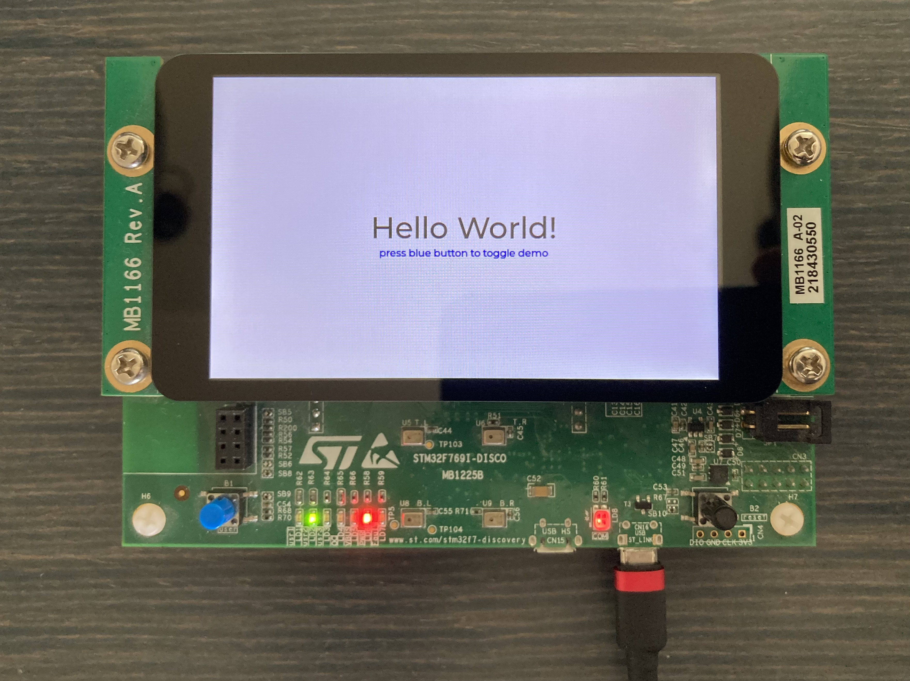

# STM32F769NI Discovery Kit (STM32F769I-DISCO) LCD Demo
Content of this repo demonstrates how to set use LCD display on STM32F769I-DISCO board with [LVGL](https://github.com/lvgl/lvgl) embedded graphics library and no OS (bare-metal) and set up VS Code development environment including build and OCD step debugging.  

# VS Code Environment Setup
## Prerequisites
* NodeJS + NPM
* Python + PIP
* Git
* VS Code
## pyOCD
* `pip install pyocd --upgrade` On Windows install as admin, otherwise install is local and PATH settings is required.
* `pyocd pack update`
* `pyocd pack find stm32f769`
* `pyocd pack install STM32F769NIHx`
## OpenOCD
* Download the latest version from https://github.com/xpack-dev-tools/openocd-xpack/releases  
or build yourself following [this guide](https://github.com/Marus/cortex-debug/wiki/How-to-build-current-OpenOCD-version-on-Windows)
* Unzip it to `OpenOCD` folder in `C:\Program Files`
* Add `C:\Program Files\OpenOCD\bin` to system PATH variable
> Note: xpm utility does not really support global installations (yet), hence I suggest the above approach.
## SVD file - MPU specific
Download from https://github.com/posborne/cmsis-svd/tree/master/data/STMicro and place in the Software root folder.
## GNU Arm Embedded Toolchain
* required version: **arm-none-eabi** (bare-metal target)
* Download from https://github.com/xpack-dev-tools/arm-none-eabi-gcc-xpack
* Set `MBED_GCC_ARM_PATH` env variable to `C:\Program Files (x86)\Arm GNU Toolchain arm-none-eabi\11.2 2022.02\bin` (latest version Windows path).
* Add `MBED_GCC_ARM_PATH` env variable to Windows `Path` env variable (`%MBED_GCC_ARM_PATH%`) - if not set by the installer.
> Note: the most official build can be found [here](https://developer.arm.com/tools-and-software/open-source-software/developer-tools/gnu-toolchain/downloads) but I do not recommend using it. `arm-none-eabi-gdb` ver. 11.2 has a buggy dependency on unsupported and retired Python 2.7.
## Required NPM packages
* `npm install -g cppbuild`
* `npm install -g shx`
* `npm install -g @serialport/terminal`
## Required VS Code plug-ins
* `C/C++` (Microsoft)
* `Cortex-Debug` (marcus25) See: https://github.com/Marus/cortex-debug/wiki
## VS Code config
* Set the default VS Code terminal to `Git Bash`. Otherwise, VS Code may try to execute task NPM packages as (e.g.) PowerShell scripts.
## Recommended VS Code plug-ins
* `LinkerScript` (Zixuan Wang)
* `Arm Assembly` (dan-c-underwood)
* `Code Spell Checker` (Street Side Software)
* `Build++` (Tomasz Jastrzębski)
## Optional
* [ST-LINK Utility](https://github.com/stlink-org/stlink)
* [STSW-LINK009](https://www.st.com/content/st_com/en/products/development-tools/software-development-tools/stm32-software-development-tools/stm32-utilities/stsw-link009.html) ST-LINK USB Driver
* [STSW-LINK007](https://www.st.com/content/st_com/en/products/development-tools/software-development-tools/stm32-software-development-tools/stm32-programmers/stsw-link007.html) ST-LINK boards firmware upgrade

# References
## Discovery kit with STM32F769NI MCU docs
* https://www.st.com/en/evaluation-tools/32f769idiscovery.html
* https://www.st.com/en/evaluation-tools/32f769idiscovery.html#documentation
* https://www.st.com/en/evaluation-tools/32f769idiscovery.html#cad-resources

## STM32F769NI MPU docs
* https://www.st.com/en/microcontrollers-microprocessors/stm32f769ni.html
* https://www.st.com/en/microcontrollers-microprocessors/stm32f769ni.html#documentation
* [DS11532](https://www.st.com/resource/en/datasheet/stm32f769ni.pdf)
* [RM0410](https://www.st.com/resource/en/reference_manual/rm0410-stm32f76xxx-and-stm32f77xxx-advanced-armbased-32bit-mcus-stmicroelectronics.pdf)

## How to add a BSP (Board Support Packages) to an STM32CubeIDE project?
https://st.force.com/community/s/article/how-to-add-a-bsp-to-an-stm32cubeide-project
